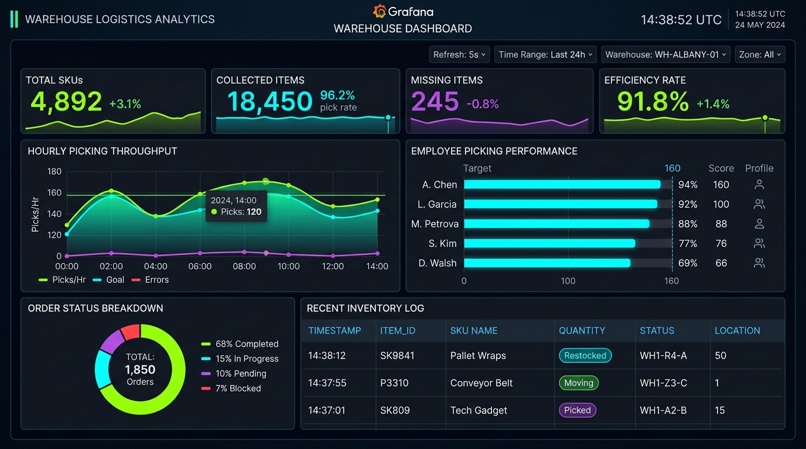
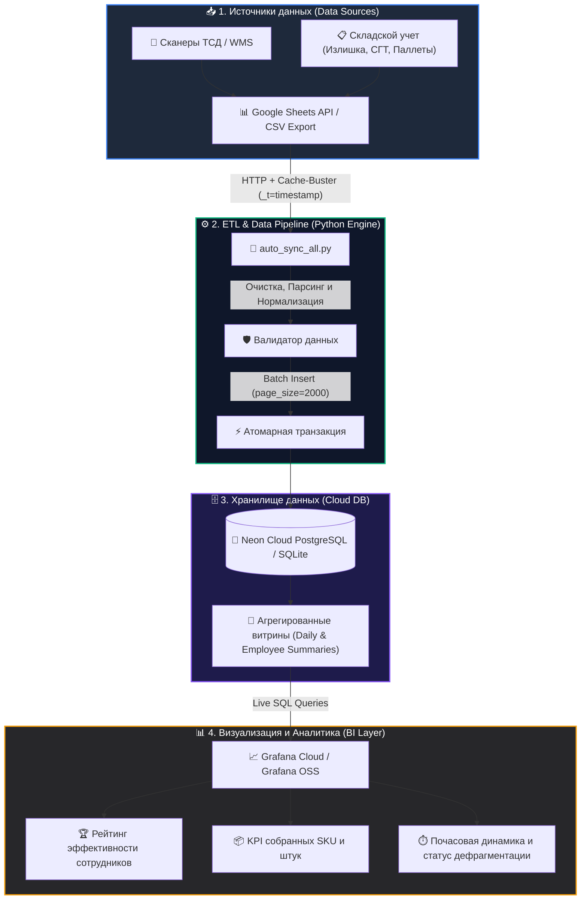

<div align="center">

# 📊 Warehouse & Logistics Analytics Platform
### Real-Time Google Sheets ➔ PostgreSQL ➔ Grafana Cloud ETL & BI System

[](https://www.python.org/)
[](https://grafana.com/)
[](https://neon.tech/)
[](https://www.docker.com/)
[](https://github.com/features/actions)
[](LICENSE)

<br />



</div>

---

## 📌 О проекте (Project Overview)

**Warehouse & Logistics Analytics Platform** — это высокопроизводительная система бизнес-аналитики (BI) и непрерывного ETL-пайплайна для автоматизации складского учета, логистических операций и мониторинга эффективности сотрудников в режиме реального времени.

Проект решает ключевую проблему складской логистики: объединение оперативных данных из мобильных терминалов сбора данных (ТСД) и Google Таблиц в единое облачное хранилище **PostgreSQL (Neon)** с мгновенной интерактивной визуализацией в **Grafana Cloud**.

---

## 🏗 Архитектура системы (System Architecture)

Система построена по микросервисной и событийно-ориентированной архитектуре:



---

## 🚀 Ключевые возможности (Key Features)

- **⚡ Непрерывная синхронизация (Near Real-Time Sync):** Автоматический сбор и загрузка данных каждые 30-60 секунд без задержек.
- **🛡️ Защита от фантомных дубликатов (Clean Atomic Replace):** Полная консистентность данных при обновлении статусов операций в исходных таблицах.
- **🚫 Устранение кэширования Google Sheets (Cache-Busting):** Прямой обход кэша Google API с гарантией актуальности каждой секунды.
- **🏆 Мониторинг производительности сотрудников:** Автоматический расчет собранных SKU, количества штук (шт), ошибок и скорости работы каждого оператора.
- **📦 Аналитика дефрагментации (СГТ) и излишков:** Моментальное выявление расхождений и отслеживание статусов размещения товаров по зонам склада.
- **☁️ 24/7 Автономная работа в облаке:** Контейнеризация через Docker и развертывание на Render / GitHub Actions без необходимости держать локальный компьютер включенным.

---

## 🛠 Стек технологий (Tech Stack)

| Компонент | Технология | Назначение |
| :--- | :--- | :--- |
| **BI & Visualization** | `Grafana Cloud`, `Grafana OSS` | Интерактивные дашборды, визуализация метрик, алерты |
| **Backend & ETL** | `Python 3.11`, `Psycopg2`, `Urllib` | Парсинг, пакетная обработка, валидация и загрузка данных |
| **Primary Database** | `PostgreSQL (Neon Serverless AWS)` | Высокоскоростная облачная реляционная СУБД для аналитических SQL-запросов |
| **Local Database** | `SQLite 3` | Локальное резервное хранилище и автономный оффлайн-режим |
| **DevOps & Cloud** | `Docker`, `Render.com`, `GitHub Actions` | 24/7 непрерывное выполнение демона, CI/CD пайплайн |
| **Data Ingestion** | `Google Sheets API`, `Apps Script` | Интеграция с рабочими таблицами терминалов склада |

---

## 📊 Структура аналитических витрин данных

База данных содержит оптимизированные таблицы и агрегаты:

- `public.sgt` — Сырые транзакции перемещения и дефрагментации товаров.
- `public.izlishka` — Журнал фиксации и обработки излишков.
- `public.sgt_daily_summary` — Дневная сводка: всего операций, собранные SKU, процент подтверждений.
- `public.sgt_daily_employee_summary` — Детальная статистика по каждому сотруднику за каждый день.
- `public.pallets` & `public.boxes` — Трекинг паллет, коробок и складских зон размещения.

---

## 💻 Установка и локальный запуск (Getting Started)

### 1. Клонирование репозитория
```bash
git clone https://github.com/theanvarow/grafana-warehouse-sync.git
cd grafana-warehouse-sync
```

### 2. Установка зависимостей
```bash
python3 -m venv venv
source venv/bin/activate
pip install -r requirements.txt
```

### 3. Разовый запуск синхронизации
```bash
python3 auto_sync_all.py
```

### 4. Запуск фонового демона (каждые 30 секунд)
```bash
python3 auto_sync_all.py 30
```

---

## 🐳 Запуск через Docker (Docker Deployment)

```bash
# Сборка Docker образа
docker build -t grafana-warehouse-sync .

# Запуск контейнера в фоновом режиме
docker run -d --name warehouse-sync --restart always grafana-warehouse-sync
```

---

## ☁️ Развертывание 24/7 в Cloud (Render / Railway)

1. Создайте **New Background Worker** на [Render.com](https://render.com).
2. Подключите данный репозиторий `theanvarow/grafana-warehouse-sync`.
3. Render автоматически определит `Dockerfile` / `Procfile` и запустит фоновую синхронизацию **24/7**.

---

## 📈 Бизнес-эффект и результаты внедрения

- ⏱ **-85% времени** на ручное составление ежедневных отчетов по сменам.
- 🎯 **100% прозрачность** индивидуальной выработки сотрудников в реальном времени.
- 🔍 **Мгновенный поиск** расхождений по SKU и ячейкам хранения.
- 📱 Доступ к дашборду для руководства с любых устройств (Desktop, Tablet, Mobile).

---

## 👨‍💻 Автор (Author)

**Sirojiddin Anvarov**
- GitHub: [@theanvarow](https://github.com/theanvarow)
- Специализация: Data Analytics, ETL Pipelines, Grafana BI, Backend Development

---

<div align="center">
  <sub>⭐️ Если проект оказался полезным, поставьте звездочку репозиторию!</sub>
</div>
