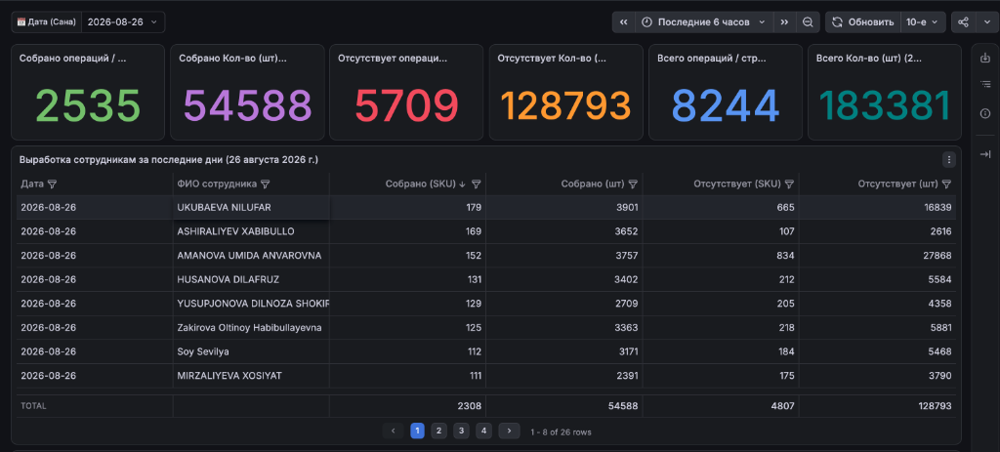
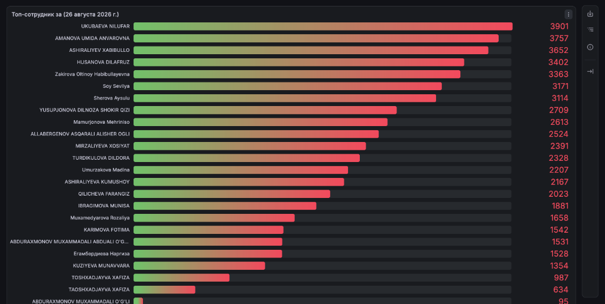
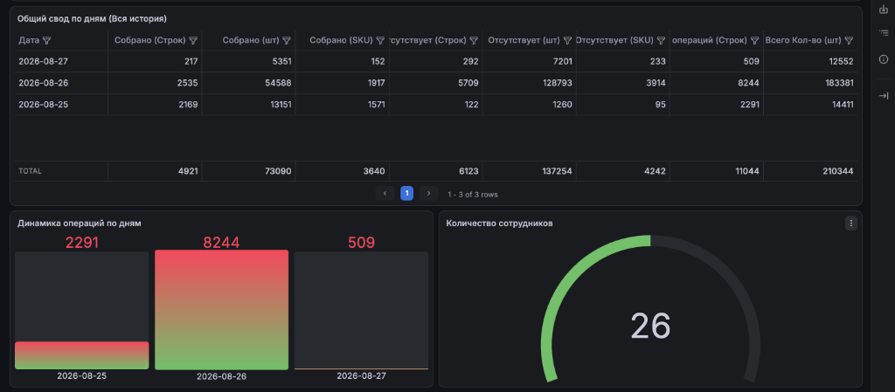

<div align="center">

# 📊 Warehouse & Logistics Analytics Platform
### Real-Time Google Sheets ➔ PostgreSQL ➔ Grafana Cloud ETL & BI System

[](https://www.python.org/)
[](https://grafana.com/)
[](https://neon.tech/)
[](https://www.docker.com/)
[](https://github.com/features/actions)
[](LICENSE)

<br />



</div>

---

## 🔗 Быстрые ссылки и Демонстрация (Live Links & Demo)

| Ресурс | Описание | Ссылка |
| :--- | :--- | :--- |
| 📊 **Grafana Dashboard** | Интерактивный аналитический дашборд | [Открыть в Grafana](http://localhost:3000/d/izlishka_employee_svod) |
| 📋 **Google Sheets (WMS)** | Исходная рабочая таблица учета склада | [Открыть Google Таблицу](https://docs.google.com/spreadsheets/d/1vRYsfBey2qTmLf9iCkxSU4tb85e6nhYZzwaQ7DrMkII/edit?gid=1647276156#gid=1647276156) |
| 🚀 **GitHub Repository** | Исходный код ETL-пайплайна и шаблоны дашбордов | [github.com/theanvarow/grafana-warehouse-sync](https://github.com/theanvarow/grafana-warehouse-sync) |
| 📦 **Cloud Database** | Облачная реляционная СУБД (Serverless AWS) | [Neon Tech PostgreSQL](https://neon.tech/) |

---

## 📌 О проекте (Project Overview)

**Warehouse & Logistics Analytics Platform** — это комплексная система сбора, автоматической очистки и сквозной аналитики складских операций (ETL + Business Intelligence) в режиме реального времени.

Проект автоматизирует обработку данных с терминалов сбора данных (ТСД) и оперативных Google Таблиц, транслируя их в облачную реляционную базу данных **PostgreSQL (Neon Serverless)** и формируя интерактивные дашборды в **Grafana Cloud**.

---

## 📸 Галерея реальных дашбордов (Visual Showcase)

### 1. 📊 Оперативные KPI и Выработка сотрудников за день
Мониторинг ключевых показателей смены (всего собрано, отсутствующие позиции, общий объем) и детальная таблица выработки с фильтрацией по SKU, штукам и статусам.

<div align="center">
  
</div>

<br />

### 2. 🏆 Рейтинг производительности сотрудников (Leaderboard)
Интерактивный Bar Gauge рейтинг лучших сборщиков и операторов склада за выбранную дату с градиентной шкалой объемов выработки.

<div align="center">
  
</div>

<br />

### 3. 📅 Общий свод по дням, динамика операций и датчик активности
Сводная историческая аналитика, тренды динамики операций по дням и спидометр-датчик количества активных сотрудников на смене.

<div align="center">
  
</div>

---

## 🏗 Архитектура системы (System Architecture)

```mermaid
flowchart TD
    subgraph S["📥 1. Источники данных (Data Sources)"]
        G1["📱 Сканеры ТСД / Складские терминалы"] --> GS["📊 Google Sheets API / Live CSV"]
        G2["📋 Журналы учета (СГТ, Излишка, Паллеты)"] --> GS
    end

    subgraph E["⚙️ 2. ETL & Data Pipeline (Python Engine)"]
        GS -->|"HTTP + Cache-Busting (_t=timestamp)"| PY["🐍 auto_sync_all.py"]
        PY -->|"Очистка типов, парсинг и валидация"| VAL["🛡️ Data Cleansing & Validator"]
        VAL -->|"Batch Insert (page_size=2000)"| AT["⚡ Clean Atomic Replace"]
    end

    subgraph D["🗄️ 3. Хранилище данных (Cloud DB)"]
        AT --> DB[("🐘 Neon Cloud PostgreSQL / SQLite")]
        DB --> AGG["📐 Агрегированные витрины (Daily & Employee Summaries)"]
    end

    subgraph V["📊 4. Визуализация и Аналитика (BI Layer)"]
        AGG -->|"Live SQL Queries (10s Auto-Refresh)"| GF["📈 Grafana Cloud / Grafana OSS"]
        GF --> D1["🏆 Рейтинг сборщиков (Bar Gauge)"]
        GF --> D2["📦 KPI собранных SKU и штук (Stat Cards)"]
        GF --> D3["📅 Исторический свод и тренды (Tables & Gauges)"]
    end

    style S fill:#1e293b,stroke:#3b82f6,stroke-width:2px,color:#fff
    style E fill:#0f172a,stroke:#10b981,stroke-width:2px,color:#fff
    style D fill:#1e1b4b,stroke:#8b5cf6,stroke-width:2px,color:#fff
    style V fill:#27272a,stroke:#f59e0b,stroke-width:2px,color:#fff
```



---

## 🚀 Ключевые возможности (Key Features)

- **⚡ Непрерывная синхронизация (Near Real-Time Sync):** Автоматическая обработка и обновление данных каждые 30 секунд.
- **🛡️ Защита от фантомных дубликатов (Clean Atomic Sync):** Полная консистентность базы данных при смене статусов и редактировании строк в Google Таблицах.
- **🚫 Устранение кэширования Google (Cache-Busting):** Прямой обход промежуточного кэша Google Sheets с гарантией 100% точности.
- **👥 Анализ выработки по сотрудникам:** Расчет уникальных SKU, общего объема товара (шт), собранных и отсутствующих позиций по сменам.
- **📦 Мониторинг дефрагментации (СГТ) и излишков:** Моментальное выявление расхождений по ячейкам склада.
- **☁️ 24/7 Автономность:** Контейнеризация в Docker и поддержка непрерывного облачного запуска (Render / GitHub Actions) без локального ПК.

---

## 🛠 Стек технологий (Tech Stack)

| Компонент | Технология | Назначение |
| :--- | :--- | :--- |
| **BI & Visualization** | `Grafana Cloud`, `Grafana OSS` | Интерактивные дашборды, визуализация метрик, алерты |
| **Backend & ETL** | `Python 3.11`, `Psycopg2`, `Urllib` | Парсинг, пакетная обработка, валидация и загрузка данных |
| **Primary Database** | `PostgreSQL (Neon Serverless AWS)` | Облачная реляционная СУБД для аналитических SQL-запросов |
| **Local Database** | `SQLite 3` | Локальное резервное хранилище и автономный оффлайн-режим |
| **DevOps & Cloud** | `Docker`, `Render.com`, `GitHub Actions` | 24/7 непрерывное выполнение демона, CI/CD пайплайн |
| **Data Ingestion** | `Google Sheets API`, `Apps Script` | Интеграция с рабочими таблицами терминалов склада |

---

## 💻 Установка и локальный запуск (Getting Started)

### 1. Клонирование репозитория
```bash
git clone https://github.com/theanvarow/grafana-warehouse-sync.git
cd grafana-warehouse-sync
```

### 2. Установка зависимостей
```bash
python3 -m venv venv
source venv/bin/activate
pip install -r requirements.txt
```

### 3. Разовый запуск синхронизации
```bash
python3 auto_sync_all.py
```

### 4. Запуск фонового демона (каждые 30 секунд)
```bash
python3 auto_sync_all.py 30
```

---

## 🐳 Запуск через Docker (Docker Deployment)

```bash
# Сборка Docker образа
docker build -t grafana-warehouse-sync .

# Запуск контейнера в фоновом режиме
docker run -d --name warehouse-sync --restart always grafana-warehouse-sync
```

---

## ☁️ Развертывание 24/7 в Cloud (Render / Railway)

1. Создайте **New Background Worker** на [Render.com](https://render.com).
2. Подключите репозиторий `theanvarow/grafana-warehouse-sync`.
3. Render автоматически определит `Dockerfile` / `Procfile` и запустит фоновую синхронизацию **24/7**.

---

## 📈 Бизнес-эффект и результаты внедрения

- ⏱ **-85% времени** на ручное составление ежедневных сводок по сменам.
- 🎯 **100% прозрачность** индивидуальной выработки сотрудников в реальном времени.
- 🔍 **Мгновенный контроль** расхождений по SKU и ячейкам хранения.
- 📱 Доступ к дашборду с любых устройств (Desktop, Tablet, Mobile).

---

## 👨‍💻 Автор (Author)

**Sirojiddin Anvarov**
- GitHub: [@theanvarow](https://github.com/theanvarow)
- Специализация: Data Analytics, ETL Pipelines, Grafana BI, Backend Development

---

<div align="center">
  <sub>⭐️ Если проект оказался полезным, поставьте звездочку репозиторию!</sub>
</div>
